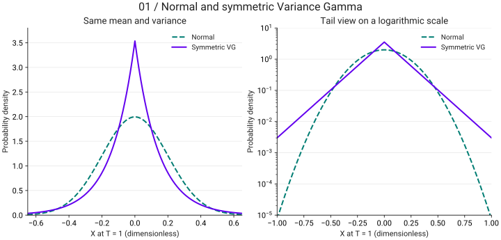

<link rel="stylesheet" href="assets/magnificent-jump.css">

# The Magnificent Jump · ตอนที่ 1

สุรพัศ หอมชุ่ม · Math Nerd · <a href="https://qc-variance-gamma-model.nutdnuy.chatgpt.site/">อ่านต้นฉบับ</a>

<nav class="vg-series-nav" aria-label="The Magnificent Jump — สามตอน"><a href="magnificent-jump-intro.html" aria-current="page">ตอนที่ 1 · Intro</a><a href="magnificent-jump-random-clock.html">ตอนที่ 2 · นาฬิกาสุ่ม (random clock)</a><a href="magnificent-jump-variance-gamma.html">ตอนที่ 3 · Variance Gamma Process</a></nav>

<header class="post-header">RESEARCH NOTE<h2>Intro</h2></header>

<blockquote>
“แม้นข้าพเจ้าจะสามารถคํานวณการเคลื่อนที่ของดวงดาวแสนอัสจรร์บนเวิ้งฟ้าได้อย่างแม่นยํา...แต่ข้าพเจ้าไม่สามารถคํานวณความบ้าคลั่งของผองชนได้เลย”
<cite>เซอร์ ไอแซค นิวตัน กล่าวถึง วิกฤติฟองสบู่หุ้นบริษัท South Sea ค.ศ. 1720</cite></blockquote>

แม้แต่นักคิดผู้ชาญฉลาดที่สุดคนนึงในประวัติศาสตร์มนุษยชาติก็ยอมแพ้ให้กับความบ้าคลั่งของตลาดหุ้น แต่ผมเข้าใจท่านเซอร์นะ ณ ตอนนั้นยังไม่มีการศึกษาพฤติกรรมของตลาดหุ้นอย่างจริงจัง จนกระทั่งเกือบสองร้อยปีต่อมา Quant คนแรกในถือกําเนิดขึ้นบนโลก เขาเป็นนักคณิตศาสตร์ชาวฝรั่งเศษที่ชื่อว่า ‘ลุยส์ บาร์เชลิเยร์ (Louis Bachelier)’ บาร์เชลิเยร์ได้เสนอแนวคิดที่ว่า ‘ราคาของหุ้นในตลาดเปลี่ยนแปลงแบบสุ่ม’ มันสุ่มไปเรื่อยไม่แน่นอน เมื่อราคาของหุ้นเปลี่ยนแปลงแบบสุ่มคณิตศาสตร์ที่จะเข้ามาอธิบายมันได้คือพวกทฤษฏีความน่าจะเป็น (Probability Theory) และ แคลคูลัสเกี่ยวกับความไม่แน่นอน (Stochastic Calculus) ซึ่งพัฒนามาจากทฤษฎีความน่าจะเป็นอีกที

สิ่งที่บาร์เชลิเยร์ตั้งคําถามต่อมาคือ ‘ราคาของหุ้นเนี่ยเปลี่นแปลงตามการแจกแจงความน่าจะเป็น (Probability Distribution) ชนิดไหน ?’ ซึ่งบาร์เชลิเยร์เสนอว่ามันเปลี่ยนตามการแจกแจงปกติ (Normal Distribution ที่เราได้เรียนครั้งแรกในวิชาสถิติตอนม.ปลายนั่นแหล่ะ) ซึ่ง model ที่เขาเสนอใช้ Brownian Motion (เป็น model ทางคณิตศาสตร์ที่เปลี่ยนแปลงแบบ Normal Distribution ตามเวลา) มาจําลองการเปลี่ยนแปลงของราคาหุ้น

ซึ่งหลังจากการเสนอของ บาร์เชลิเยร์ ก็มีนักคณิตศาสตร์ (หลังจากนี้ผมจะเรียกว่า Quant ละกัน เพราะ Quants สําหรับผมคือนักคณิตศาสตร์/นักฟิสิกส์ ที่ศึกษาพฤติกรรมของตลาด) พัฒนา model ต่อจากเขาโดยใช้ Brownian Motion เป็นส่วนประกอบ ซึ่ง model ที่โด่งดังมากคือ Geometric Brownian Motion ที่ใช้ในสมการเปลี่ยนโลก Black-Schole and Merton Equation (สมการนี้ได้ฉายาว่า ‘สมการล้านล้านดอลลาร์’ the trillion dollars equation) สมการ Black-Schole นี้ใช้ในการตั้งราคาตราสารอนุพันธ์ประเภท Option ซึ่งผมจะอ้างอิงในหัวข้อด้านล่างแต่ตอนนี้ช่างมันก่อน

กลับมาที่ Brownian Motion และ พฤติกรรมของตลาด ต่อมาพวก Quants เริ่มเห็นแล้วว่า ‘ราคาหุ้นในตลาดไม่ได้เปลี่ยนแปลงตาม Normal Distribution และ Brownian Motion/Geometric Brownian Motion ไม่เพียงพอในการสร้าง model จําลองราคาหุ้น’ ทําไงล่ะที่นี้? แต่ก่อนที่จะไปหาทางแก้เราไปดูหลักฐานกันก่อนว่าแล้วราคาหุ้นในตลาดเปลี่ยนแปลงยังไงกันแน่

จากข้อมูลเก่า เมื่อพวก Quants นําอัตราผลตอบแทน (rate of return หรืออาจจะเป็น log-return) มาพล็อตกราฟ พบว่ากราฟของผลตอบแทนมีจุดสูงสุด (sharp peak) ที่สูงกว่า Normal Distribution ไปมาก ไม่เพียงเท่านั้นตรงหาง(tail) ของกราฟยังมีลักษณะตํ่ากว่าตัว Normal Distribution (เราเรียก distribution ลักษณะนี้ว่า heavy-tailed distribution)

จิตนาการภาพง่ายๆ ให้นึกว่าตัวกราฟ Normal Distribution เป็นเหมือนเยลลี่เด้งดึ๋ง จากนั้นเราเอามือมากดหางของตัวกราฟ Normal Distribution ไว้ไม่ข้างใดก็ข้างหนึ่งหรืออาจจะทั้งสองข้างทําให้หางบุ๋มลง (เกิดเป็น heavy-tailed) พอไอ้เยลลี่ Normal Distribution โดนกดก็ไม่พอใจเลยขัดขืนบวกกับมันพยายามดิ้นให้หลุดจากการโดนกดเลยเอาหัวหม่งขึ้นบนหรืออาจจะเบ้ซ้ายหรือเบ้ขวา ในทิศตรงข้ามกับที่เรากดหางของมัน (เกิดเป็น sharp peak)

โดยในทางคณิตศาสตร์เรามีตัววัดระดับความ peak เรียกว่า ‘Kurtosis’ และวัดระดับความเบ้เรียกว่า ‘Skewness’ (Skewness เกิดขึ้นตอนเรากดหางไอ้เยลลี่ Normal Distribution แค่ข้างเดียว เกิดเป็นกราฟที่ทั้งเอียงและทั้งหัวโด่ แต่ถ้าเรากดมันทั้งสองข้างก็จะไม่มี Skewness มีแต่ Kurtosis เกิดเป็นกราฟสมมาตรแต่ยังหัวโด่) ***คําว่าหัวโด่หมายถึงตัว Kurtosis ของการฟสูงกว่าตัว Kurtosis ของ Normal Distribution

เมื่อพวก Quants เห็นดังนั้นก็ตั้งคําถามต่อว่า “distribution พวกนี้มันเกิดจากอะไรหว่า?” พอหาคําตอบก็ค้นพบว่า distribution พวกนี้เกิดจาก

<ol class="numbered"><li>เหตุการณ์ที่ตลาด shock ผู้คนเกิดอาการตื่นตระหนกรุมกันเทขายหุ้นทําให้ราคาดิ่ง หรือรุมกันซื้อหุ้นทําให้ราคาพุ่งแรง ในกรณีแรกในทางคณิตศาสตร์จะเรียกว่า “Negative Big Jump” ส่วนในกรณีหลังจะเรียกว่า “Positive Big Jump”</li><li>การที่กิจกรรมการ trade หุ้นของผู้คนไม่ได้เกิดตลอดเวลาทําให้ตัวราคาหุ้นเปลี่ยนแบบ “ไม่ต่อเนื่อง (discontinuous)” ทําให้เกิดเป็น ‘Small Jump (รวมทั้ง negative และ positive)’ ขึ้น ***</li></ol>

ซึ่งตัว model ที่มี Brownian Motion เป็นส่วนประกอบจะมีสมมติฐานคือ กิจกรรมการ trade หุ้นในตลาดเกิดอย่างต่อเนื่อง (continuous) นี่จึงเป็นเหตุผลสําคัญว่าทําไม model ที่มีเพียง Brownian Motion เป็นส่วนประกอบจึงไม่เพียงพอ เมื่อเป็นดังนี้เราจึงต้องสร้าง models ขึ้นมาใหม่ ‘แล้วจะสร้าง models ใหม่ยังไงห้ะ?’ ต้องติดตามโพสต์ต่อไป

<aside class="note">*** หมายเหตุ ความจริงเหตุการณ์ที่ตลาด shock ในข้อ 1) ก็คือการที่ราคาหุ้นเกิดการเปลี่ยนแปลงแบบไม่ต่อเนื่องในข้อ 2) นั่นแหล่ะ เพียงแต่ผมต้องการให้ผู้อ่านเห็นภาพระหว่าง big jump และ small jump ซึ่ง quants บางคนจะเรียกรวมๆว่า jump ไปเลย</aside>

<section class="vg-visual" aria-label="Viz เพิ่มเติม">

## Viz เพิ่มเติม

Viz เพิ่มเติม · ตัวอย่างสมมติ: เปรียบเทียบ Normal กับ symmetric Variance Gamma ที่มีค่าเฉลี่ย 0 และ variance 0.04 เท่ากัน กำหนด T = 1, θ = 0, σ = 0.2, ν = 1, μ = 1 กรณีนี้ VG เป็น Laplace distribution กราฟขวาใช้แกนความหนาแน่นแบบ log; ไม่ใช่ข้อมูลตลาด

[แบบจำลองอ้างอิงสำหรับ Viz: Madan, Carr & Chang (1998)](https://engineering.nyu.edu/sites/default/files/2018-09/CarrEuropeanFinReview1998.pdf)

</section>

<nav class="vg-series-nav" aria-label="The Magnificent Jump — สามตอน"><a href="magnificent-jump-intro.html" aria-current="page">ตอนที่ 1 · Intro</a><a href="magnificent-jump-random-clock.html">ตอนที่ 2 · นาฬิกาสุ่ม (random clock)</a><a href="magnificent-jump-variance-gamma.html">ตอนที่ 3 · Variance Gamma Process</a></nav>

[ดาวน์โหลด Notebook รวม 3 ตอน](notebooks/the-magnificent-jump.ipynb)
