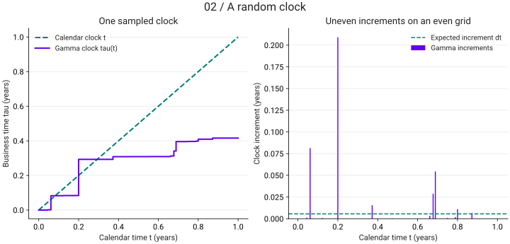

<link rel="stylesheet" href="assets/magnificent-jump.css">

# The Magnificent Jump · ตอนที่ 2

สุรพัศ หอมชุ่ม · Math Nerd · <a href="https://qc-variance-gamma-model.nutdnuy.chatgpt.site/">อ่านต้นฉบับ</a>

<nav class="vg-series-nav" aria-label="The Magnificent Jump — สามตอน"><a href="magnificent-jump-intro.html">ตอนที่ 1 · Intro</a><a href="magnificent-jump-random-clock.html" aria-current="page">ตอนที่ 2 · นาฬิกาสุ่ม (random clock)</a><a href="magnificent-jump-variance-gamma.html">ตอนที่ 3 · Variance Gamma Process</a></nav>

การจะสร้าง jump model มีวิธีการหลักๆอยู่ 3 วิธี แต่ในที่นี้เพื่อไม่ให้ NERD เกินไปและให้สอดคล้องกับตัวอย่างในโพสต์ถัดไป ผมจะนําเสนอเพียงวิธีเดียวนั่นคือวิธีที่ชื่อว่า “ยัดนาฬิกาสุ่ม (random clock) เข้าไปใน Brownian Motion หรือ วิธี Subordination of Brownian Motion” แต่ก่อนไปสร้าง model เราต้องทําความรู้จัก ‘นาฬิกาสุ่ม (random clock)’ กันก่อน

<h2 id="random-clock">นาฬิกาสุ่ม (random clock)</h2>

เหมือนที่ผมกล่าวในโพสต์ที่แล้วว่าตลาดหุ้นเปลี่ยนแปลงแบบไม่ต่อเนื่อง (discontinuous) พวก Quants จึงสร้างเวลาขึ้นมาใหม่เพื่อล้อกับตัวความไม่ต่อเนื่องนี้ สมมติให้เวลาที่ถูกสร้างขึ้นนี้คือ τ (ภาษากรีก อ่านว่า ‘ทัลก์ (tau)’ หรือ ‘เทา’ นั่นแหล่ะง่ายๆ)

ซึ่งตัว τ นี่แหล่ะคือที่เราเรียกว่า นาฬิกาสุ่ม (random clock) โดยปัจจัยที่ส่งผลต่อ τ คือ เหตุการณ์ต่างๆ (random events)/ข้อมูล (information) และ ‘เวลา (t)’ ซึ่งต่อไปนี้เราจะแทน

<ul class="mapping"><li>เวลา (ธรรมดา)<b>t</b></li><li>เหตุการณ์ต่างๆ (random events) / ข้อมูล (information)<b>ω</b></li><li>เวลาสุ่ม / นาฬิกาสุ่ม<b>τ</b></li></ul>

โดย τ เป็นฟังก์ชันของ t และ ω หรือ τ(t,ω) นั่นเองและในบริบทนี้ τ คือเวลาที่ราคาหุ้นจะเปลี่ยน ซึ่งในเมื่อ τ นั้น ‘สุ่ม’ หมายความว่าเราต้องกําหนดด้วยว่า τ นั้นมีความแจกแจงความน่าจะเป็น (probability distribution) ประเภทอะไร เราจะพูดถึงหลักการในการกํานดตัว probability distribution ของ τ ในหัวข้อการสร้าง model แต่ก่อนที่จะไปสร้างตัว model เรามาทําความรู้จักคร่าวๆก่อนว่า ‘probability distribution’ กับ ‘probability process (หรือ stochastic process) ต่างกันอย่างไรเพื่อต่อไปจะได้ไม่สับสน

<h2>ความแตกต่างระหว่าง Probability Distribution และ Stochastic Process</h2>

ง่ายๆเลยคือตัว probability distribution เป็นฟังก์ชันของ ‘เหตุการณ์สุ่ม (random events) ω’ ส่วน stochastic process เป็นฟังก์ชันของ ‘เหตุการณ์สุ่ม (random events) ω และ เวลา t’ ถ้าเขียนในรูปฟังก์ชันจะได้ว่า

<figure aria-label="สมการต้นฉบับ" class="equation" role="group" tabindex="0"><figcaption>Probability Distribution</figcaption>
f(ω)
</figure><figure aria-label="สมการต้นฉบับ" class="equation" role="group" tabindex="0"><figcaption>Stochastic Process</figcaption>
f(t,ω)
</figure>

ในทางคณิตสาสตร์ถ้าตัวแปรสุ่ม X ไม่ขึ้นกับเวลาเราจะเขียนว่า X(ω) หรือย่อว่า X เฉยๆอย่างที่คุ้นๆกันดี (เป็น probability distribution) แต่ถ้าตัวแปรสุ่ม X ขึ้นกับเวลา เราจะเขียนว่า X(t,ω) หรือย่อว่า X(t) (เป็น stochastic process)

ยกตัวอย่าง Stochastic Process เช่น Brownian Motion เป็น normal distribution ที่มี parameters ขึ้นกับเวลา

<figure aria-label="สมการต้นฉบับ" class="equation" role="group" tabindex="0">
B(t) ~ Normal Distribution(0, √t)
</figure>

B(t) แทน Brownian Motion จะเห็นว่า B(t) เป็น Normal Distribution ที่มีค่าเฉลี่ย (mean) เป็นศูนย์ และ ค่า standard deviation เป็น √t (ค่า square root ของเวลา) ซึ่งจะเห็นชัดเจนว่าเมื่อเวลา t เปลี่ยน parameter ก็จะเปลี่ยนตาม (ในกรณีนี้คือ standard deviation)

<aside class="note">* Stochastic process X(t) อาจจะเป็นได้หลาย probability distributions ขึ้นอยู่กับเวลาที่เปลี่ยนแปลงไป แต่ในโพสต์นี้และโพสต์ถัดไปเราจะพูดถึงแค่ stochastic process ที่มี probability distribution ชนิดเดิมแม้เวลาจะเปลี่ยน (ชนิดของ probability distribution ไม่เปลี่ยน แต่ค่า parameters ที่ควบคุม probability distribution เปลี่ยนตามเวลาอยู่ดี)</aside>

มาถึงตรงนี้เราจะสังเกตุได้ว่าเจ้า ‘นาฬิกาสุ่ม τ(t,ω)’ นั้นเป็น Stochastic Process

<h2 id="build-model">สร้าง Model</h2>

Model ประเภทนี้เราจะเริ่มตั้งต้นว่าการเปลี่ยนแปลงของราคาหุ้น (หรือเป็นอัตราผลตอบแทน rate of return ก็ได้) เปลี่ยนตาม Brownian Motion เหมือนเดิม เพียงแต่เปลี่ยน ‘เวลา(t)’ ข้างในตัว Brownian Motion เป็น ‘เวลาสุ่ม(τ)’ แทน จาก B(t) เฉยๆกลายเป็น B(τ(t,ω)) โดย B(t) หมายถึง Brownian Motion มาถึงตอนนี้เราจะเห็นแล้วว่าจากที่

<figure aria-label="สมการต้นฉบับ" class="equation" role="group" tabindex="0">
B(t) ~ Normal Distribution(0, √t)
</figure>เป็น<figure aria-label="สมการต้นฉบับ" class="equation" role="group" tabindex="0">
B(τ(t,ω)) ~ ???
</figure>

โดยตัว B(τ) (ต่อไปนี้ผมจะเขียน B(τ(t,ω)) หรืออาจจะเขียน B(τ) สลับไปมาแล้วแต่บริบท) จะมีหน้าตาเป็นแบบไหนนั้นขึ้นอยู่กับ τ นั่นเอง

<h2>Stochastic Process ของ τ</h2>

มีงานวิจัยมมากมาย นําเสนอ Stochastic Process ของเจ้านาฬิกาสุ่ม τ ซึ่งในที่นี้ผมจะนําเสนอผลงานของ Peter Carr, Dilip Madan และ Eric Chang ซึ่งเป็น Quants ที่ผมนับถือมากๆ (โดยเฉพาะ Peter Carr) ท่านเสนอ model ที่นาฬิกาสุ่ม τ เป็น Gamma Process หรือก็คือ Gamma Distribution ที่เปลี่ยนแปลงตามเวลา t โดยเจ้า Gamma distribution นี้ถูกกํากับด้วย parameters μ (อ่านว่า ‘มิว’ หรือ ‘mu’) และ ν (อ่านว่า ‘นู’ หรือ ‘nu’) โดย

<dl class="parameters">
<dt>μ</dt><dd>คือ อัตราค่าเฉลี่ยต่อหนึ่งหน่วยเวลา หรือ mean rate</dd>

<dt>ν</dt><dd>คือ อัตราความแปรปรวนต่อหนึ่งหน่วยเวลา หรือ variance rate</dd>
</dl>

เมื่อนํามาเขียนในรูปของ Gamma Process จะได้ว่า

<figure aria-label="สมการต้นฉบับ" class="equation" role="group" tabindex="0">
τ Gamma Distribution(μt, νt)
</figure>

โดย parameters μ และ ν สองตัวนี้จะคอยควบคุมทั้งความเบ้ (skewness) และ ความ peak (kurtosis) ใน model ราคาหุ้นของเรานั่นเอง

ในโพสต์ถัดไป ผมจะพูดถึงกระบวนการสุ่ม (stochastic process) ที่เกิดจากการยัดนาฬิกา gamma process นี้เข้าไปใน Brownian Motion และวิธีการตั้งราคาตัวอนุพันธ์ Options จาก process นี้

<aside class="note">***โพสต์ถัดไปจะ nerd มากๆ โพสต์ที่ผ่านๆมาผมพยายามเต็มที่ที่จะอธิบายเป็นภาษามนุษย์โลกอย่างสุดความสามารถ แต่โพสต์ถัดไปคงหลีกเลี่ยงความ nerd ไม่ได้จริงๆ อย่าเพิ่งยอมแพ้ครับ</aside>

<section class="vg-visual" aria-label="Viz เพิ่มเติม">

## Viz เพิ่มเติม

Viz เพิ่มเติม · ตัวอย่างจำลอง Gamma clock หนึ่งเส้นทาง: μ = 1, ν = 0.25, T = 1 ปี แบ่ง 180 time steps, seed = 2026092002 ใช้ Gamma increments ที่มี shape = Δt/ν และ scale = ν ภาพแสดงค่าบนกริดเวลา ไม่ได้แสดงทุก jump ระหว่างจุดสังเกต

[แบบจำลองอ้างอิงสำหรับ Viz: Madan, Carr & Chang (1998)](https://engineering.nyu.edu/sites/default/files/2018-09/CarrEuropeanFinReview1998.pdf)

</section>

<nav class="vg-series-nav" aria-label="The Magnificent Jump — สามตอน"><a href="magnificent-jump-intro.html">ตอนที่ 1 · Intro</a><a href="magnificent-jump-random-clock.html" aria-current="page">ตอนที่ 2 · นาฬิกาสุ่ม (random clock)</a><a href="magnificent-jump-variance-gamma.html">ตอนที่ 3 · Variance Gamma Process</a></nav>

[ดาวน์โหลด Notebook รวม 3 ตอน](notebooks/the-magnificent-jump.ipynb)
