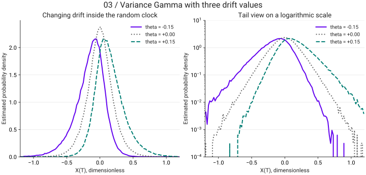

<link rel="stylesheet" href="assets/magnificent-jump.css">

# The Magnificent Jump · ตอนที่ 3

สุรพัศ หอมชุ่ม · Math Nerd · <a href="https://qc-variance-gamma-model.nutdnuy.chatgpt.site/">อ่านต้นฉบับ</a>

<nav class="vg-series-nav" aria-label="The Magnificent Jump — สามตอน"><a href="magnificent-jump-intro.html">ตอนที่ 1 · Intro</a><a href="magnificent-jump-random-clock.html">ตอนที่ 2 · นาฬิกาสุ่ม (random clock)</a><a href="magnificent-jump-variance-gamma.html" aria-current="page">ตอนที่ 3 · Variance Gamma Process</a></nav>

เราเรียก stochastic process ที่เกิดจากการยัดนาฬิกาสุ่ม gamma เข้าไปใน Brownian Motion ว่า ‘Variance Gamma Process’ โดยสิ่งสําคัญที่สุดก่อนที่จะไปสร้าง model คือเราต้องทําความรู้จักเจ้า Variance Gamma Process กันก่อน

<h2 id="variance-gamma">Variance Gamma Process</h2>

เราทราบกันแล้วว่าตัว Variance Gamma Process นั้นเกิดจาก stochastic processes ทั้งหมดสองอันคือ

<ol class="numbered detailed"><li><strong>Gamma Process</strong> — เป็น process ของเจ้านาฬิกาสุ่ม τ โดยมีการแจกแจงแบบ gamma distribution ตามเวลา ซึ่ง gamma process มี probability density function (PDF) ดังนี้<figure aria-label="สมการต้นฉบับ" class="equation" role="group" tabindex="0">
ft(τ) =<!-- --> (μ/ν)μ²t/ν · τμ²t/ν − 1 · exp(−μτ/ν)Γ(μ²t/ν), τ &gt; 0
</figure>
โดย fₜ คือ PDF ของนาฬิกาสุ่ม τ
</li><li><strong>Brownian Motion</strong> — เป็น process ดั้งเดิมที่เหล่า Quants ค้นพบว่าไม่เพียงพอในการทํา models โดยมีการแจกแจงแบบ normal distribution ตามเวลา ซึ่ง Brownian Motion โดยปกติจะมี PDF ดังนี้<figure aria-label="สมการต้นฉบับ" class="equation" role="group" tabindex="0">
Nt(x) =<!-- --> 1σ√(2πt) <!-- -->exp−(x − θt)²2σ²t, x∈ℝ, t &gt; 0
</figure>
โดยที่ t เป็นเวลาปกติ ซึ่งพอเราปลี่ยน t เป็นเวลาสุ่ม τ จะได้ว่า
<figure aria-label="สมการต้นฉบับ" class="equation" role="group" tabindex="0">
Nτ(x) =<!-- --> 1σ√(2πτ) <!-- -->exp−(x − θτ)²2σ²τ, x∈ℝ, τ &gt; 0
</figure></li></ol>

ใน research paper ที่ผมอ้างอิง เขากําหนดให้ μ = 1 *** ใน PDF ของ Gamma Process และ Brownian Motion ที่นํามาใช้จะเพิ่มตัวแปร drift θ และ ความผันผวน (Volatility) σ เข้าไปด้วย

จากนั้นเราจะได้ว่า PDF ของ Variance Gamma Process ซึ่งเกิดจากการยัดนาฬิกาสุ่ม τ เข้าไปใน Brownian Motion with drift ดังนี้

<figure aria-label="สมการต้นฉบับ" class="equation" role="group" tabindex="0">
Gt(x) = ∫0∞ 1σ√(2πτ) <!-- -->exp−(x − θτ)²2σ²τ(1/ν)t/ν · τt/ν − 1 · exp(−τ/ν)Γ(t/ν) <!-- -->dτ, x∈ℝ, τ &gt; 0
</figure>

โดยที่ Gₜ(x) คือ PDF ของ Variance Gamma Process เราจะเห็นว่า Gₜ(x) เกิดจากการอินทิเกรตตัวแปร τ ตั้งแต่ 0 ถึง ∞ ดังนั้นฟังก์ชัน Gₜ(x) จะเป็นฟังก์ชันของตัวแปร t (เวลาที่ไม่สุ่ม) กับ x (ในที่นี้จะแทน log-return ดังที่จะกล่าวต่อไปในไม่กี่อึดใจ)

ถึงตอนนี้หลายท่านอาจจะงงว่าอะไรคือตัวแปร drift θ กับตัวแปร Volatility σ ผมต้องท้าวความก่อนว่าปกติ Brownian Motion ที่มี mean=0 และ variance= t เราจะเรียกว่า Standard Brownian Motion จะเขียนอยู่ในรูป B(t) แต่ในกรณีที่เราจะปรับตัว mean ให้ไม่เท่ากับศูนย์เราจะบวกตัวแปร ‘drift’ เข้าไปเรียกว่า Brownian Motion with drift และเพิ่มเติมจาก drift เราจะคูณตัวแปร Volatility σ (ในที่นี้คือค่า standard deviation ของ Normal Distribution) เข้าไปใน Brownian Motion เพื่อสะท้อนความเป็นจริงมากที่สุด ซึ่งจะเขียนในรูป

<figure aria-label="สมการต้นฉบับ" class="equation" role="group" tabindex="0">
θt + σB(t)
</figure>

โดยที่ค่า mean ของ Brownian Motion with drift คือ E(θt+σB(t))=θt และค่า Variance คือ Var(θt+σB(t))=σ²t นั่นเอง และเวลายัดนาฬิกาสุ่ม gamma เข้าไปเพื่อสร้าง Variance Gamma Process เราก็ยัดนาฬิกาสุ่มเข้าไปในตัว drift ด้วยเป็น

<figure aria-label="สมการต้นฉบับ" class="equation" role="group" tabindex="0">
θτ + σB(τ)
</figure>

<aside class="note">Note : อีกหัวข้อหนึ่งที่เป็นหัวข้อสําคัญมากใน models ประเภท jump processes คือ ความรู้เรื่อง Levy Measure และ Characteristic Function แต่เพื่อไม่ให้โพสต์ยาวเกินไป ผมจะละเรื่องนี้เอาไว้</aside>

<h2>การสร้าง Model จําลองราคาหุ้นโดยใช้ Variance Gamma Process</h2>

ในหัวข้อนี้เราจะมาสร้าง model จําลองราคาหุ้นโดยใช้ Variance Gamma Process กัน ซึ่งผมจะเปรียบเทียบตัว Variance Gamma Model กับ Geometric Brownian Motion Model (เป็นตัวอย่าง Model ที่ใช้ Brownian Motion และยังเป็น Model ที่ใช้ในการตั้งราคา option ใน formula ก้องโลกอย่าง Black-Schole Formula) เป็นระยะๆ เพื่อให้ผู้อ่านเห็นภาพความแตกต่างชัดเจนยิ่งขึ้น

<figure aria-label="สมการต้นฉบับ" class="equation" role="group" tabindex="0"><figcaption>Geometric Brownian Motion Model</figcaption>
dSt = θStdt + σStdB(t)
</figure><figure aria-label="สมการต้นฉบับ" class="equation" role="group" tabindex="0"><figcaption>Variance Gamma Model</figcaption>
dSt = mStdt + StdX(τ; θ,σ)
</figure>

ใน Variance Gamma Model

<dl class="parameters">
<dt>m</dt><dd>คือ อัตราค่าเฉลี่ยของผลตอบแทนของหุ้นในหนึ่งหน่วยเวลา</dd>

<dt>Sₜ</dt><dd>คือ ราคาหุ้น ณ เวลา t ใดๆ</dd>

<dt>X(τ; θ,σ) หรือ Xₜ</dt><dd>คือ Variance Gamma Process ที่เกิดจากการยัดนาฬิกาสุ่ม Gamma τ เข้าไปใน Brownian Motion with drift ที่มี ตัวแปร drift คือ θ และตัวแปร volatility คือ σ</dd>
</dl>

ต่อไปผมจะเป็นค่า Mean, Variance, Skewness และ Kurtosis ของ Variance Gamma Process:

Variance Gamma Process, X(τ; θ,σ,μ = 1)<figure aria-label="สมการต้นฉบับ" class="equation" role="group" tabindex="0"><figcaption>Mean</figcaption>
θt
</figure><figure aria-label="สมการต้นฉบับ" class="equation" role="group" tabindex="0"><figcaption>Variance</figcaption>
(θ²ν + σ²)t
</figure><figure aria-label="สมการต้นฉบับ" class="equation" role="group" tabindex="0"><figcaption>Skewness</figcaption>
(2θ³ν² + 3σ²θν)t((θ²ν + σ²)t)3/2
</figure><figure aria-label="สมการต้นฉบับ" class="equation" role="group" tabindex="0"><figcaption>Kurtosis</figcaption>
(3σ⁴ν + 12σ²θ²ν² + 6σ⁴ν³)t + (3σ⁴ + 6σ²θ²ν + 3σ⁴ν²)t²((θ²ν + σ²)t)²
</figure>

จะเห็นได้ชัดเจนว่า kurtosis และ skewness ถูกควบคุมโดยตัวแปร ν และ μ=1 เพิ่มเติมจากตัวแปร θ และ σ ใน Geometric Brownian Motion

<h2 id="option-pricing">การตั้งราคา Option โดยใช้ Variance Gamma Process</h2>

โดยปกติทุกคนอาจจะคุ้นเคยกับสูตร Black-Schole Formula ซึ่งเกิดจาก Geometric Brownian Motion กันเป็นอย่างดี คราวนี้เรามาดูกันว่าถ้าเปลี่ยนจาก Geometric Brownian Motion เป็น Variance Gamma Model ตัวสูตรจะหน้าตาเป็นอย่างไร ซึ่งผมจะบอกข่าวดีก็คือ

<ul class="dash-list"><li>จาก paper ที่ผมใช้อ้างอิง เราสามารถเขียน formula ของราคา option โดยใช้ Variance Gamma Model ได้หรือก็คือมันมี closed form นั่นเอง ซึ่งในหลายๆ models ที่ซับซ้อนเราไม่สามารถเขียนตัวสูตรของราคา option ได้</li><li>เราสามารถหาสูตรราคา options ของ Variance Gamma Model โดยใช้ Black-Schole formula เป็นตัวตั้งตอนเริ่มได้ ซึ่งจะช่วยได้เยอะ เราจะมาดูกันว่าทํายังไง</li></ul>

ผมต้องบอกก่อนว่า options ที่เราจะกําหนดราคานี้เป็น European call option ที่จ่าย pay-off ในวันหมดอายุของสัญญาเท่านั้น หลักการตั้งราคา option มีดังนี้

<ol class="numbered detailed"><li>เราต้องรู้ pay-off ของ option ก่อนซึ่งในที่นี้คือ<figure aria-label="สมการต้นฉบับ" class="equation" role="group" tabindex="0">
max(ST − K, 0)
</figure>
โดย T คือ เวลาที่สัญญาหมดอายุ K คือ ราคา strike ฟังก์ชัน max(∙) ใส่มาเพื่อระบุว่า ถ้าหากราคาหุ้น ณ เวลาหมดสัญญาตํ่ากว่าราคา Strike ตัว pay-off ของสัญญาจะถือว่ามีค่าเป็น 0
</li><li>เราต้องการหาราคาของ European options ณ เวลา t ใดๆ ซึ่งถ้าเกิดเรารู้อนาคตว่าราคาหุ้น ณ วันหมดอายุสัญญา STเป็นเท่าไรแล้วราคาของ Options ก็ควรจะเป็น pay-off ณ วันหมดอายุคูณกลับมาด้วยปริมาณดอกเบี้ยทบต้น<figure aria-label="สมการต้นฉบับ" class="equation" role="group" tabindex="0">
e−r(T−t)(ST − K); ST &gt; K
</figure>
แต่ปัญหาคือเนื่องจากราคาหุ้น S นั้นเป็น Stochastic Process ซึ่งไม่แน่นอน เราไม่สามารถรู้ได้ว่าาราคาหุ้น ณ เวลาหมดสัญญา ST นั้นจะมีค่าเท่าไรเพราะเราไม่รู้อนาคต สิ่งที่เราจะทําได้คือหาค่าเฉลี่ย (mean) หรือ Expected Value ดังนั้นราคา option ณ เวลา t ใดๆควรจะเป็น (แต่ยังไม่ใช่)
<figure aria-label="สมการต้นฉบับ" class="equation" role="group" tabindex="0">
Ct = e−r(T−t)E(ST − K | ℱt); ST &gt; K
</figure>
Ct คือ ราคาของ European Call Option ณ เวลา t ใดๆ สัญลักษณ์ ℱt เป็นสัญลักษณ์ใน Measure Theory หมายถึงว่าตอนนี้เรามีข้อมูลอยู่ถึงแค่ ณ เวลา t
</li><li>(ข้อนี้สําคัญที่สุด) ปัญหายังไม่ได้หมดแค่นี้เพราะในการกําหนดราคา Option เราต้องการที่จะหา ‘ราคาที่ป็นกลาง’ หรือก็ราคาที่ไม่ทําให้เกิด arbitrage จากการ trade ตัว Option และหุ้น ซึ่งเราจําเป็นที่จะต้องใช้หลัก Measure Theory เข้ามาช่วย โดยในที่นี้เราจะต้องเปลี่ยนจาก statistical measure เป็น risk neutral measure เพื่อทําให้<figure aria-label="สมการต้นฉบับ" class="equation" role="group" tabindex="0">
e−r(T−t)E(ST − K | ℱt)
</figure>มีสมบัติเป็น martingale *** ซึ่งผมจะละการเปลี่ยน measure เอาไว้ เพราะมันจะกินเนื้อที่เยอะเกินไปมาก โดยหลังจากเปลี่ยนเป็น risk-neutral measure แล้ว Variance Gamma model ของเราจะเปลี่ยนไปสักหน่อย จาก<figure aria-label="สมการต้นฉบับ" class="equation" role="group" tabindex="0">
dSt = mStdt + StdX(τ; θ,σ)
</figure>เป็น<figure aria-label="สมการต้นฉบับ" class="equation" role="group" tabindex="0">
dSt = rStdt + StdX(τ; θRN,σRN)
</figure>
จะเห็นได้ว่หลังจากเปลี่ยน measure แล้ว อัตราผลตอบแทนของหุ้นในหนึ่งหน่วยเวลาถูกเปลี่ยนจาก m เป็นให้เท่ากับอัตราดอกเบี้ย r และ ตัว parameter ถูกเปลี่ยนจาก θ และ σ เป็น θRN และ σRN เพราะ ใน Variance Gamma Model ค่า parameters หลังจากเปลี่ยน measure แล้วจะมีค่าเปลี่ยนไป
</li></ol>

<aside class="note">*** Paper ของ Harrison and Kreps ชื่อ ‘Martingale and Arbitrage in Multiperiod Securities Markets’ ได้พิสูจน์แล้วว่า การที่เราจะตั้งตัวราคา Options ไม่ให้เกิด arbitrage ก็ต่อเมื่อตัว models ของราคาหุ้นต้องมีสมบัติเป็น martingale แต่ใน statistical measure ตัว model ของเราไม่ใช่ martingale เราจึงต้องใช้เทคนิคการเปลี่ยน measure เป็น risk-neutral measure หรือในภาพใหญ่กว่าคือ martingale measure (risk neutral measure คือ measure ที่ rate of return ของราคาหุ้นเท่ากับอัตราดอกเบี้ยซึ่งสอดคล้องกับหลักการ Efficient Market Hypothesis แต่ว่า risk neutral measure เป็นเพียงหนึ่งในบรรดา martingale measure เท่านั้น ในการที่จะตั้งราคา option ไม่ให้เกิด arbitrage ในโลกความจริงที่เป็น incomplete market เราต้องการเพียง martingale ไม่จําเป็นต้องเป็น risk neutral measure ก็ได้)</aside>

เพราะฉะนั้นสมการตั้งราคา จะเป็น

<figure aria-label="สมการต้นฉบับ" class="equation" role="group" tabindex="0">
Ct = e−r(T−t)EQ(ST − K | ℱt); ST &gt; K
</figure>

โดย EQ หมายถึง expected value ที่คิดจาก risk neutral measure

มาถึงคราวนี้เราจะหาตัว formula ของ Ct กัน ดังจะเห็นได้จาก pdf ของ variance gamma process หาได้จากการอินทิเกรตของผลคูณระหว่าง pdf ของ Brownian Motion (ซึ่งก็คือ Normal Distribution) กับ pdf ของ Gamma Process ของนาฬิกาสุ่ม ข่าวดีคือในกรณีที่ข้างในอินทิเกรตมีแค่ Brownian Motion อย่างเดียวตัว Expected Value ของราคา Option ก็คือ Black-Schole Formula นั่นเอง เราจึงสามารถนํา Black-Schole Formula มาช่วยในการอินทิเกรตหา Formula ของ Variance Gamma option price ผ่านการเปลี่ยนรูปตัวแปรได้ดังนี้

<figure aria-label="สมการต้นฉบับ" class="equation" role="group" tabindex="0">
Ct = e−r(T−t)EQ(ST − K | ℱt); ST &gt; K = ∫0∞ c(g)<!-- --> gt/ν−1 exp(−g/ν)νt/ν Γ(t/ν) <!-- -->dg
</figure>

โดยที่

<figure aria-label="สมการต้นฉบับ" class="equation" role="group" tabindex="0">
c(g) = S(0)(1 − c1)t/ν exp(c1g/ν) Nd√g <!-- -->+ (α+s)√g − K exp(−rt)(1 − c2)t/ν exp(c2g/ν) Nd√g <!-- -->+ α√g
</figure>

ทั้งนี้ c1 = ν(α+s)²/2, c2 = να²/2 และ N() หมายถึง Cumulative Distribution Function (CDF) ของ Normal Distribution ซึ่ง c(g) เป็น Black-Schole Typed Formula (เกิดจากการดัดแปลงตัว Black-Schole formula)

เมื่อเราอินทิเกรตต่อจะได้ว่า

<figure aria-label="สมการต้นฉบับ" class="equation" role="group" tabindex="0">
Ct = S(0) Ψd√(1−c₁)√ν, (α+s)√ν1−c₁, t/ν − Ke−rt Ψd√(1−c₂)√ν, α√ν1−c₂, t/ν
</figure>

โดยที่ d = (1/s)[ln(S(0)/K) + rt + (t/ν) ln((1−c₁)/(1−c₂))] และ

Ψ() คือ modified Bessel’s function of the second kind (ฟังก์ชันนี้มีอยู่ใน library เช่น Python (Scipy) หรือมีเป็น built-in ใน Matlab และ C++)

และในที่สุดเราก็ได้ closed-form formula ของ Ctดังที่ใจปราถนา

<h2 id="limitations">ข้อเสียของ Variance Gamma Model</h2>

<blockquote class="compact-quote">
“All models are wrong but some are useful.”
<cite>George E.P . Box</cite></blockquote>

ทุก models เป็นเพียงเครื่องมือที่ใช้จําลองโลกความจริง ซึ่งโลกความจริงนั้นซับซ้อนมาก ไม่มีทางเลยที่จะมี models ไหนไร้ที่ติ ตัว Variance Gamma Model ของเราก็เหมือนกัน ข้อเสียของ Variance Gamma Model มีหลักๆอยู่ 2 ประการดังนี้

<ol class="numbered detailed"><li><strong>Constant Volatility</strong> — เราจะเห็นได้ว่าในตัว Variance Gamma Model มี parameter ของ volatility เท่ากับ σ ซึ่งเป็นค่าคงที่ แต่ในความเป็นจริง volatility ในตลาดหุ้นมีสมบัติเป็น Stochastic Process เช่นเดียวกับตัวราคาหุ้นเลย เพราะฉะนั้นด้วยเหตุนี้ตัว Variance Gamma Model จึงอธิบายได้แค่การเปลี่ยนแปลงของราคาหุ้นแต่อธิบายการเปลี่ยนแปลงของ volatility ไม่ได้ ด้วยเหตุนี้ Variance Gamma Model (รวมถึง jump models ทุกประเภทที่มี volatility เป็นค่าคงที่) จึงเหมาะสําหรับใช้ในการตั้งราคา short-term option หรือ option ที่มีเวลาหมดอายุสัญญาไม่เกิน 3 เดือนเท่านั้น แต่ไม่เหมาะอย่างยิ่งในการตั้งราคา long-term option ที่ volatility จะมีผลมากๆ (ใน long-term ตัว models ที่มี volatility เป็น Stochastic process อาจจะเหมาะสมกว่า เช่น Heston model และ SVJ model เป็นต้น)</li><li><strong>Specific Jump Activity</strong> — การ jumps ในตลาดทุกครั้งมี ประเถท ของ jump activity อยู่ ซึ่งจะมีอยู่ด้วยกันหลักๆ คือ 4 ประเภท แต่ใน Variance Gamma Model อธิบายได้แค่ jump activity ประเภทเดียวคือประเภท infinite activity with finite variation ซึ่งในโลกความเป็นจริง jump activity อาจจะเป็นประเภทอื่น (ปัญหานี้สามารถแก้ได้ด้วยการใช้ CGMY model ที่เป็น general case ของ Variance Gamma Model)</li></ol>

สุรพัศ หอมชุ่ม Math Nerd<small>ลูกสมุนของ นัท QC</small>

<section class="vg-visual" aria-label="Viz เพิ่มเติม">

## Viz เพิ่มเติม

Viz เพิ่มเติม · จำลอง X(T) = θG + σ√G Z โดย G เป็น Gamma(shape = T/ν, scale = ν) และ Z เป็น Standard Normal ที่เป็นอิสระจาก G ใช้ T = 1, ν = 0.4, σ = 0.2, μ = 1 และ θ = −0.15, 0, 0.15 จำนวน 160,000 ตัวอย่างต่อค่า θ, seed = 2026092003 เป็น histogram จากข้อมูลจำลอง ไม่ใช่ผล fit ตลาดหรือการคำนวณราคา Option

[แบบจำลองอ้างอิงสำหรับ Viz: Madan, Carr & Chang (1998)](https://engineering.nyu.edu/sites/default/files/2018-09/CarrEuropeanFinReview1998.pdf)

</section>

<nav class="vg-series-nav" aria-label="The Magnificent Jump — สามตอน"><a href="magnificent-jump-intro.html">ตอนที่ 1 · Intro</a><a href="magnificent-jump-random-clock.html">ตอนที่ 2 · นาฬิกาสุ่ม (random clock)</a><a href="magnificent-jump-variance-gamma.html" aria-current="page">ตอนที่ 3 · Variance Gamma Process</a></nav>

[ดาวน์โหลด Notebook รวม 3 ตอน](notebooks/the-magnificent-jump.ipynb)
